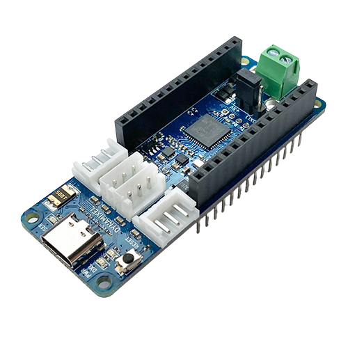
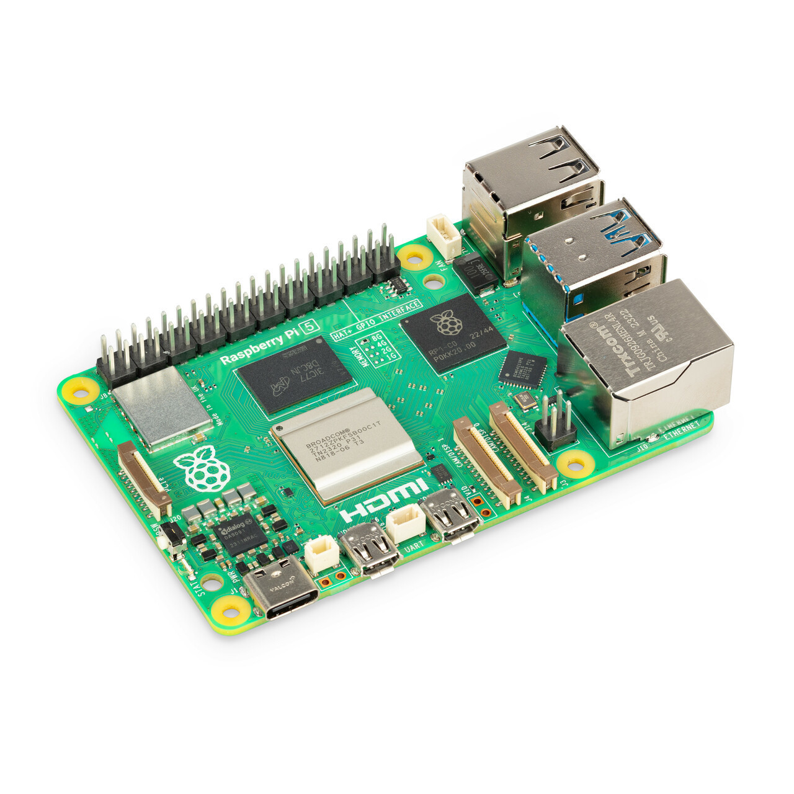
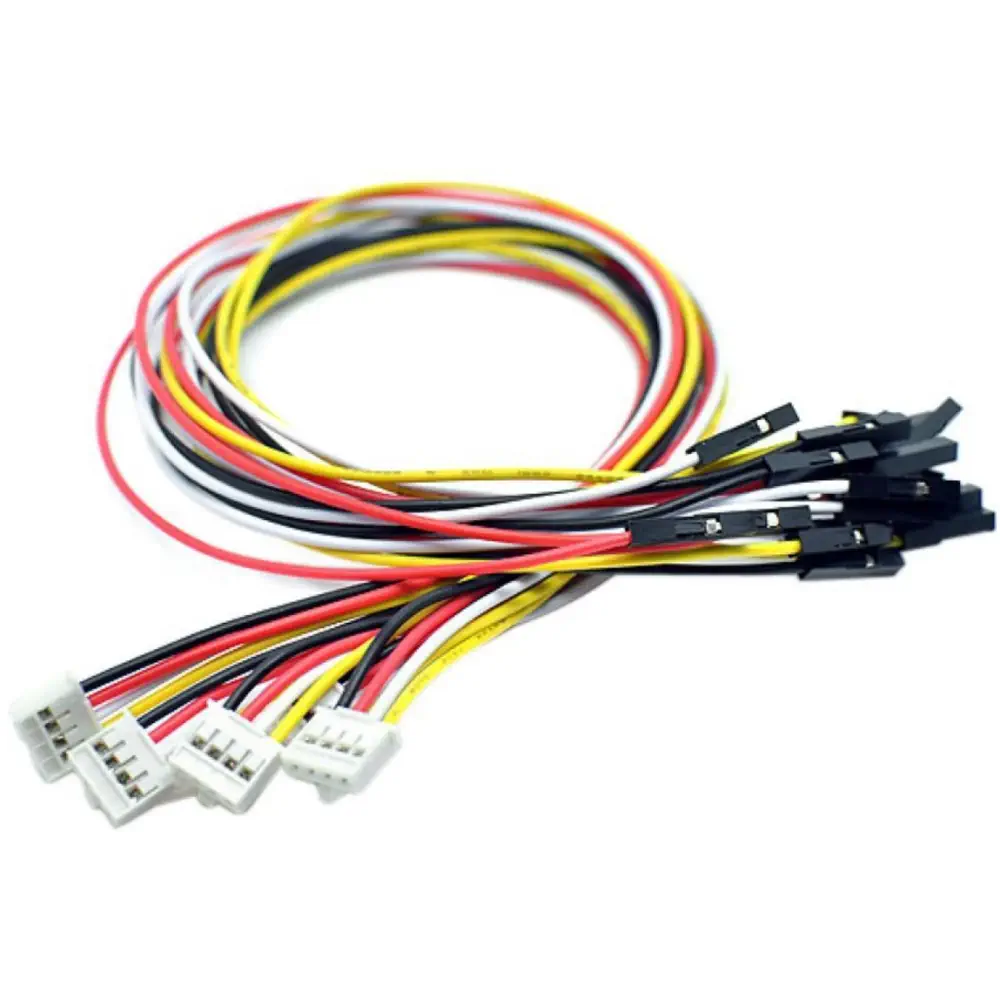
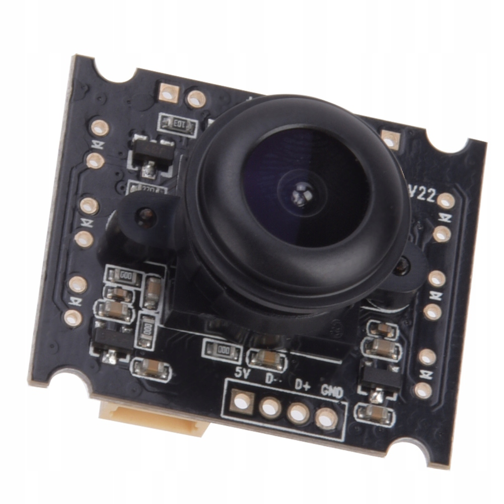
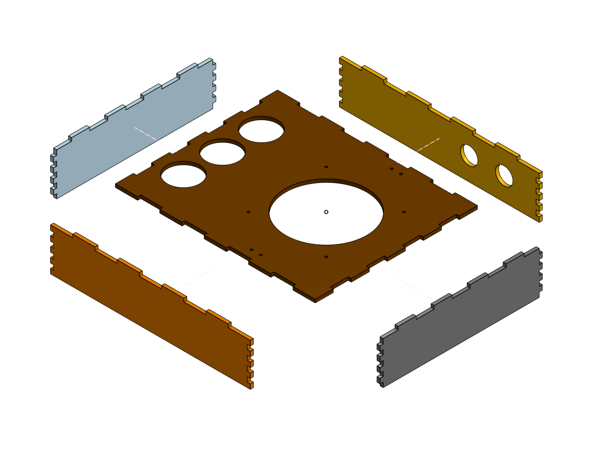
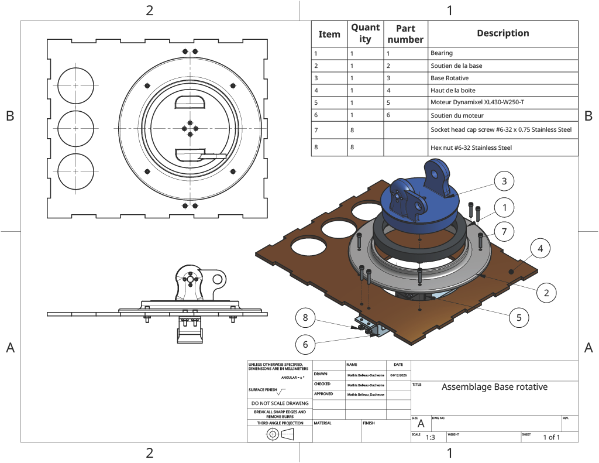
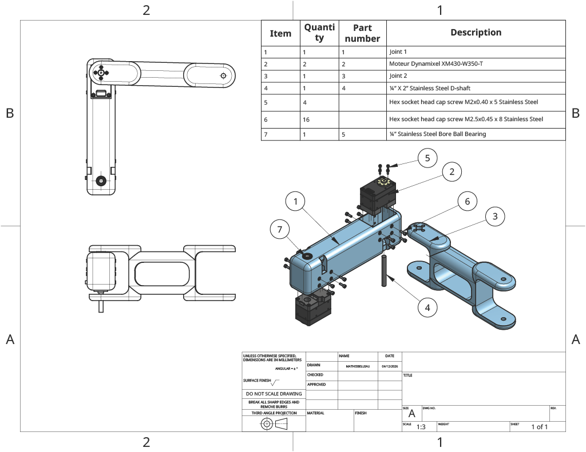
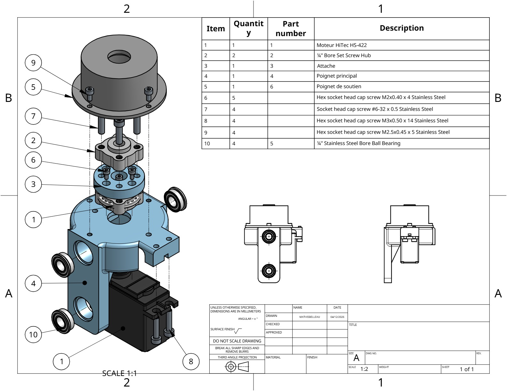
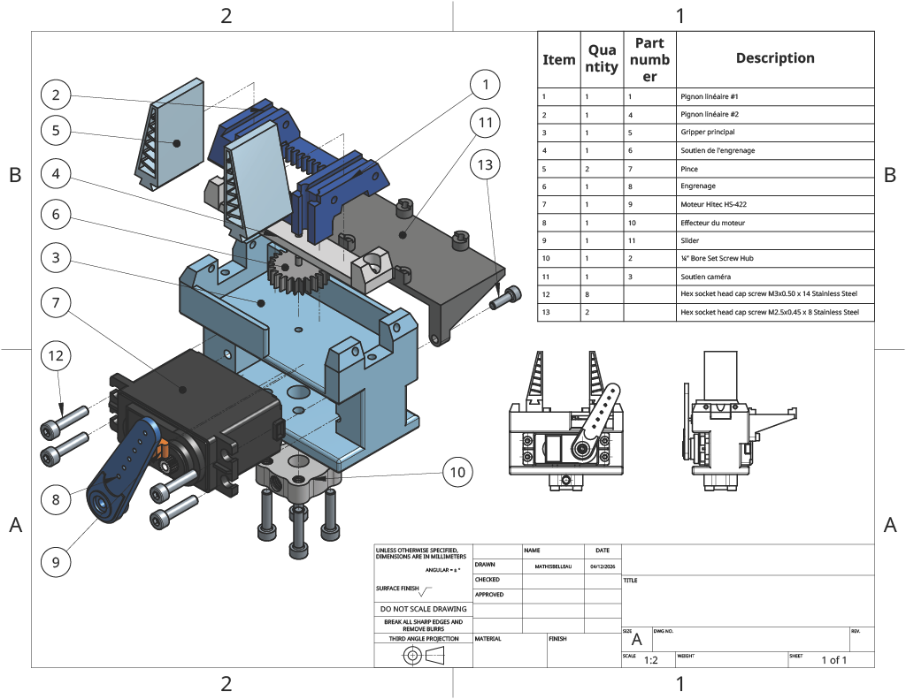
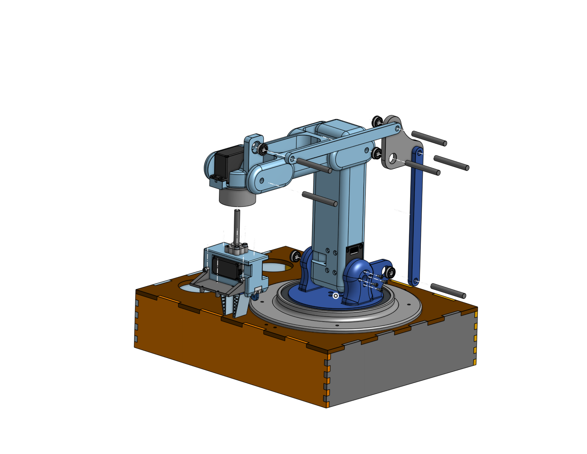

\#\#Ajout d’une photo du robot final\#\#

## **Liste des matériaux et composantes** 

---
Pièces à imprimer :  
Voir les modèles 3D ici : [Dossier CAD](../CAD/)

Mécanique :

* 8 vis ¾” X 6-32  
* 8 écrou hexagonal \#6-32  
* 22 Vis M2.5 X 8 mm  
* 14 Vis M3 X 16 mm  
* 4 Vis M3 x 5 mm  
* 16 Vis M2 x 5 mm   
* 9 ¼” X 2” Stainless Steel D-shaft  
* 2 ¼” Bore Set Screw Hub   
* 2 2mm X 70mm Stainless Steel shaft  
* 2 Moteurs Dynamixel XM430-W350-T  
* 1 Moteur Dynamixel XL430-W250-T  
* 2 Moteurs Hitec HS-422  
* X ¼” Stainless Steel Bore Ball Bearing  
* Ball bearing ACROPIX 6821ZZ \-\> [Amazon](https://www.amazon.ca/dp/B0DD48GHNL/ref=sspa_dk_hqp_detail_aax_0?sp_csd=d2lkZ2V0TmFtZT1zcF9ocXBfc2hhcmVk&th=1)  

Électrique :

* Arduino OpenRB  

* Raspberry Pi 5  

* Connecteurs Grove  

* Caméra HBVCAM 3M2111 V22  

  

  
**Assemblage mécanique du robot**  
Avant de procéder à l’assemblage, assurez-vous d’avoir toutes les pièces nécessaires, d'avoir imprimé toutes les parties et d'avoir découpé au laser la base en bois.

1. **Assemblage de la base en bois**  
  
   

2. **Assemblage de la base rotative**

 

3. **Assemblage des joints 1 et 2**

 

4. **Assemblage du poignet**

5. **Assemblage de l’effecteur**

\*Les pinces sont imprimés en 3D en TPU.

6. **Assemblage final**
  
\* S’assurer que tous les servomoteurs sont positionnés à leur position initiale (0°).
